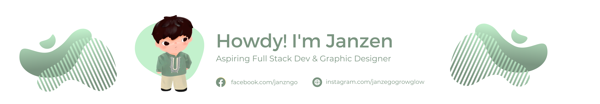

  

  

    
    
  

 

Howdy! I'm **Janzen**, a Full Stack Developer and IT graduate from the Philippines. I enjoy building things, experimenting with new technologies, and turning ideas into practical digital experiences.

I'm particularly interested in the intersection of **development, UI/UX, design, and automation**.

### About Me

* Developer focused on building modern web applications
* Information Technology graduate
* Background in graphic design and UI/UX
* Exploring AI-assisted development and automation
* Interested in open-source projects and learning by building
* Still hate light mode themes!

### Tech Stack

  

  <i>Build. Break. Learn. Repeat.</i>

